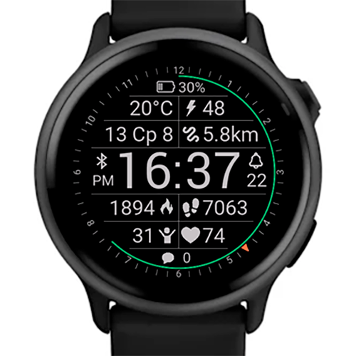
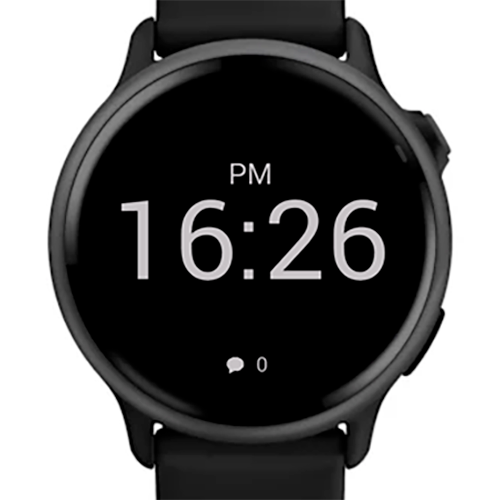

# Simple & Readable Watch Face for Garmin Vivoactive 6

  

  
  
  

---

## 📌 Features
- **Heart rate** ❤️
- **Steps counter** 👟
- **Distance** 📏
- **Body Battery** 🔋
- **Calories burned** 🔥
- **Weather temperature** 🌡️
- **Stress level** 😓
- **Messages count** 💬
- **Battery level** 🔋 + %
- **Connection status** 📶
- **Active alarm indicator** ⏰
- **Outer progress rings** — hours & minutes

---

## 🌙 Night Minimalist Mode
A clean, minimal design with just the essential information.  
Easily configurable through watch face settings.

---

## 📷 Screenshots
### Main Mode

### Night Mode

---

## 📲 Device Compatibility
Currently **only supported on Garmin Vivoactive 6**.  
If you would like to see support for other devices — please open an [issue](https://github.com/darkyfoxy/garmin-plain-watch-face/issues) or contact me.

---

## ⚙️ Settings
- Enable/disable **Night Mode**
- Adjust **start/end times** for Night Mode

---

## 🚀 Installation
1. Download from the [Garmin Connect IQ Store](#).

